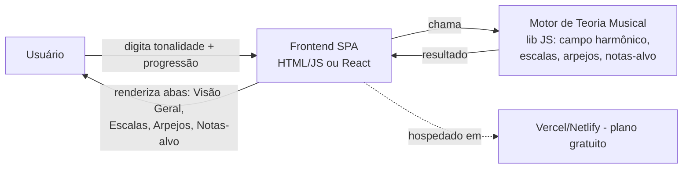
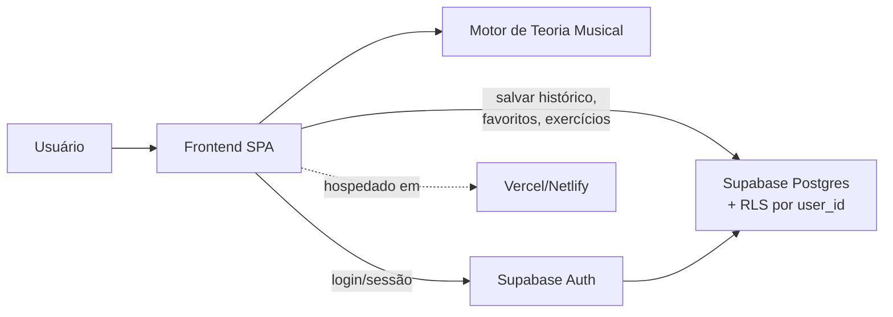
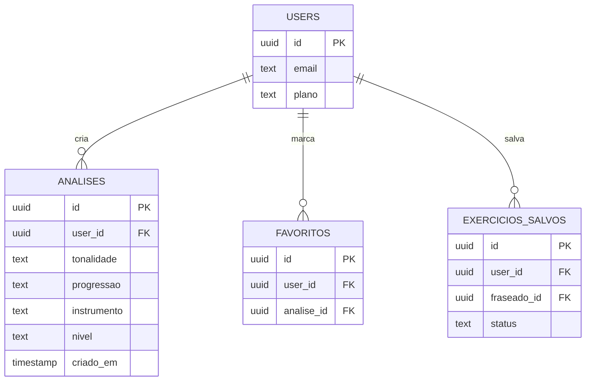
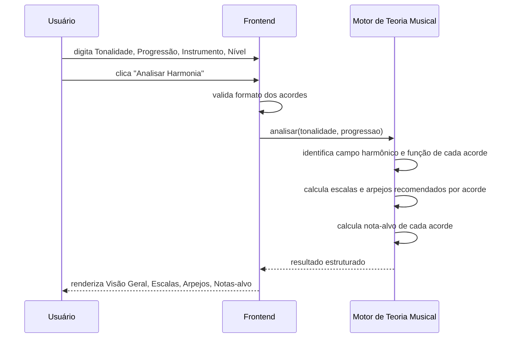
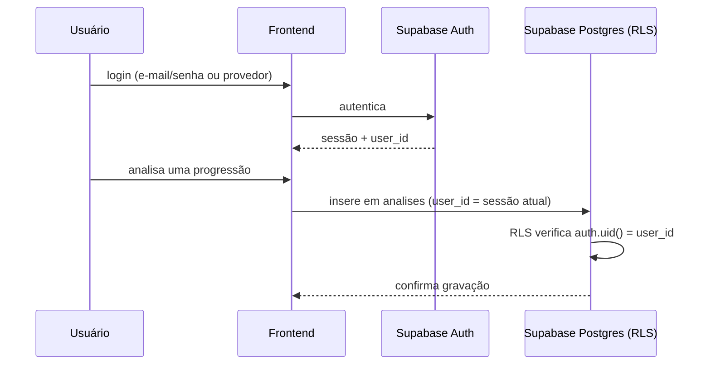

# Mapa do Sistema — ImprovisaLab

## 1. Arquitetura — Etapa 1 (sem login, custo zero)

Nesta etapa não existe backend nem banco de dados: tudo roda no navegador do
usuário. Isso é o que permite custo zero.

## 2. Arquitetura — a partir da Etapa 4 (login/histórico)

## 3. Modelo de dados (a partir da Etapa 4)

## 4. Fluxo principal — "Analisar Harmonia" (Etapa 1)

## 5. Fluxo futuro — Login e salvar histórico (Etapa 4)

